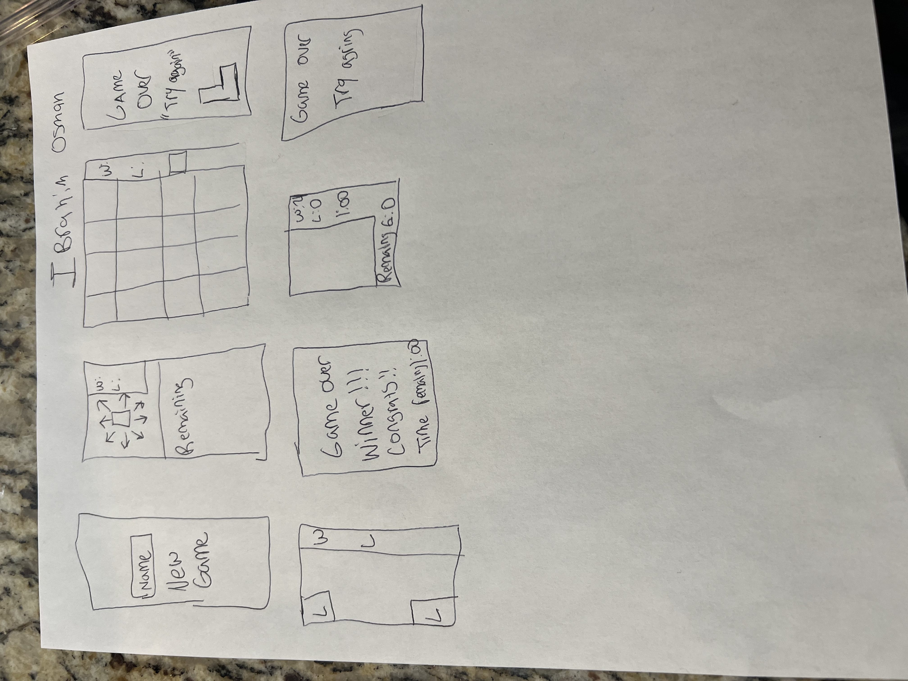

# Concentration

## Overview


Welcome to the Concentration Game project! This implementation provides a simple console-based version of the classic Concentration (also known as Memory) game. It's designed for those interested in learning basic game development concepts, including memory management, game logic, and user input handling. 


## User Stories

As a player, I want to see a grid of face-down cards when the game starts, so I can begin playing.

As a player, I want the cards to be randomly shuffled each time I start a new game, to provide a fresh challenge.

As a player, I want to be able to flip over two cards at a time, so I can try to find matching pairs.

As a player, I want the game to prevent me from flipping over more than two cards at once, to maintain the game's rules.

As a player, I want to see the cards stay face-up for a brief moment, allowing me to remember their symbols and locations.

As a player, I want the game to check if the two flipped cards match, and if they do, keep them face-up on the grid.

As a player, I want the game to hide the cards again if they don't match, so I can continue trying to find pairs.

As a player, I want to see a counter of my moves, so I can keep track of my progress.

As a player, I want the game to end when all pairs have been found, displaying a congratulatory message and my final score.

As a player, I want the ability to start a new game after completing one, to continue playing and improving my memory.

As a player, I want to have an option to exit the game gracefully, so I can leave when I'm finished playing.

As a player, I want to hear pleasant sounds or see animations when I find a matching pair, adding a positive feedback element.

As a player, I want to have a timer to see how long it takes me to complete the game, for an added challenge.

## Wireframes / Screenshots



## Psuedocode

```
Randomized Grid: Enjoy a new challenge with a shuffled grid each time.

Move Counter: Keep track of your progress with the move counter.

Replay Option: Start a new game anytime by clicking the replay button.

Customizable Grid Size: Adjust the difficulty with different grid sizes.

#version 2
more levels
it will have a easy medium and hard mode
more themes will be allowed
new buzzer noises and timers will be longer 
